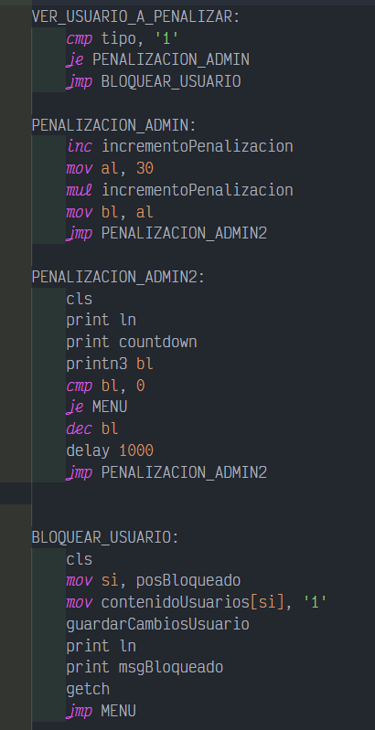

# Proyecto 2 - Manual Técnico

## Arquitecutra de Computadores y Ensambladores 1 Sección A
| Nombre                           | Carné                                      |
|:--------------------------------:|:------------------------------------------:|
| Daniel Reginaldo Dubón Rodríguez | 201901772                                  |

## ASSEMBLER

Ensamblador es un lenguaje de programacion de bajo nivel
consiste en un conjunto de mnemonicos que representan
instrucciones basicas para los procesadores,
microprocesadores, microcontroladores y otros circuitos
integrados programables.
Su implementacion es mediante la representacion simbolica de
los codigos binarios de maquina estos se usan para programar
la arquitectura del procesador.
El lenguaje assembly tiene la representacion mas directa del
codigo maquina especifico para cada arquitectura, que puede ser
legible por un programador.

## DOSBOX

DOSBox es un emulador que recrea un entorno similar al sistema DOS con el
objetivo de poder ejecutar programas y videojuegos originalmente escritos para el
sistema operativo MS-DOS de Microsoft en computadoras más modernas o en
diferentes arquitecturas.
DOSBox es un emulador de CPU completo, no solo una capa de compatibilidad
como DOSEmu o las máquinas con DOS virtual de Windows y OS/2, que
aprovechan las posibilidades de virtualización de la familia de procesadores Intel
80386. No requiere un procesador x86 ni una copia de MS-DOS o cualquier otro
DOS para ejecutarse, y puede ejecutar juegos que requieran que la CPU esté en
modo real o modo protegido.

 

## MASM v6.11
Microsoft Macro Assembler es un ensamblador para la familia x86 de 
microprocesadores. Soporta una amplia variedad de facilidades para macros y 
programación estructurada, incluyendo bucles, llamadas a procedimientos y 
alternación

## CODIGO
## INDICE
1. Variables
2. Procedimientos
3. Macros
### Variables
Aca en esta se declararon las variables de texto que sirven para mostrar los diferentes mensajes de texto en pantalla

 

Aca muestra los mensajes de errores que puedan ocurrir en el programa

 

En esta area se declaron las variables de tipo numerico que serviran para llevar control sobre el programa.

 

Aca se declararon las variables que almacena las posiciones en que se generaran y avanzaran los distintos bloques de tetris.

 

Aca se declararon las variables que serviran para poder llevar el control de login y registro del usuario

 

En esta area se declararon las variables que serviran para escribir en el archivo de reporte de ordenamientos

 

## ETIQUETAS

### MENU

Se muestra la logica implementada para la creacion del menu principal, dependiendo de que tecla se presione, ejecutara alguna de las opciones seleccionadas

 

### LOGIN
Permite realizar el login de un usuario validando sus credenciales y distinguiendo el tipo de usuario

 

### REGISTRO

Permite realizar el registro de un usuario validando las restricciones para el nombre de usuario y la contraseña

 

### VER_USUARIO_A_PENALIZAR, PENALIZACION_ADMIN, PENALIZACION_ADMIN2, BLOQUEO_USUARIO

Estas etiquetas permiten realizar un tipo de penalizacion por ingresar tres veces incorrectamente su contraseña, distinguiendo el tipo de usuario

 

### ADMINISTRADOR

Esta etiqueta muestra el menu del adminstrador y detecta las opciones a seleccionar

 

### VERIFICAR_BLOQUEADO

Verifica si el usuario que trata de ingresar tiene bloqueado su usuario

 

### DESBLOQUEAR_USUARIO

Desbloquea a un usuario especificado

 

### PROMOVER_USUARIO

Le da privilegios de administrador a un usuario normal

 

### DEGRADAR_USUARIO

Le quita privilegios de administrador a un usuario que lo hayan promovido anteriormente

 

### BUBBLE_SORT, HEAP_SORT, QUICK_SORT

Muestra los menus de los diferentes tipos de ordenamientos

 

### CONFIGURACION_PRE_JUEGO

Hace una configuracion inicial para poder entrar en modo video

 

### PANTALLA_NIVEL

Muestra la pantalla de cambio de nivel, haciendo que el juego comience si se presiona la tecla de espacio

 

### JUEGO

Logica del juego tetris, controla el movimiento, generacion de piezas, control del tiempo, nivel

 

### MOV_LEFT, MOV_RIGHT

Mueve las piezas hacia la derecha o izquierda

 

### TOP10_GLOBAL, TOP10_USUARIO

Muestra el top 10 de mejores tiempos del usuario en concreto y tambien el top de comparando con el ranking general de usuarios.

 

### MENU_SENTIDO_ORDENAMIENTO

Muestra el menu para escoger el sentido que tendra el ordenamiento

 

### CONFIGURAR_ASCENDENTE, CONFIGURAR_DESCENDENTE

Configura el sentido dependiendo de la opcion que se haya escogido en el menu

 

### MENU_METRICA_ORDENAMIENTO

Muestra el menu para escoger la variable con que hara el ordenamiento

 

### CONFIGURAR_PUNTAJE, CONFIGURAR_TIEMPO

Configura la metrica dependiendo de la opcion que se haya escogido en el menu

 

### MENU_VELOCIDAD_ORDENAMIENTO

Muestra el menu para escoger la velocidad que tendra la animacion del ordenamiento

 

### CONFIGURAR_VELOCIDAD_LENTA, CONFIGURAR_VELOIDAD_MEDIA, CONFIGURAR_VELOCIDAD_RAPIDA

Configura la velocidad del ordenamiento dependiendo de la opcion que se haya escogido en el menu

 

### GENERAR_REPORTE_ORDENAMIENTO

Genera el reporte final del ordenamiento

 

## PROCEDIMIENTOS

### dibujarPantalla

Dibuja los elementos graficos de la pantalla de juego

 

### dibujarPantallaPausa

Muestra la pantalla de pausa, con su informacion requerida

 

### dibujarPantallaTerminado

Dibuja la pantalla al terminar el juego

 

### DelayPantalla

Permite hacer un retraso para refrescar la pantalla de juego y dar la animacion de movimiento

 

### VSync

Ayuda a sincronizar los graficos para poder observar la pantalla estable

 

### random

Permite generar una pieza de tetris aleatoria

 

### verificarPosY

Verifica la posicion de la pieza en el eje Y

 

### tiempoJuego

Lleva el control del tiempo en juego

 

## MACROS

### pritnc

Hace posible imprimir un texto en pantalla con un color especificado

 

### printn

Permite imprimir un numero de dos cifras en pantalla

 

### cls

Permite limpiar la pantalla

 

### getch

Permite el ingreso de un caracter a traves del teclado

 

### getch2

Permite el ingreso de una ruta para abrir un archivo

 

### getText

Permite el ingreso de las expresiones aritmeticas en la calculadora

 

### limpiarCadena

Permite limpiar la cadena donde se almacena la expresion aritmetica a operar

 

### leerArchivo

Permite leer un archivo y guardar su contenido

 

### generarReporte

Permite generar el reporte del programa

 

### abrirArchivo

Permite abrir un archivo en modo lectura/escritura

 

### cerrarArchivo

Permite cerrar un archivo previamente abierto

 

### escribirArchivo

Permite escribir en un archivo

 

### convertirCadena

Permite convertir un numero en cadena para poder imprimirlo en pantalla

 

### generarFecha

Genera la fecha y guarda el resultado en sus variables asignadas

 

### generarHora

Genera la hora actual que tiene el sistema y la guarda en sus variables asignadas

 

### getUsuarioRegistro, getUsuarioLogin

Permite obteener los usuarios en el ambito del registro y login

 

### verificarNumero, verificarMayuscula, verificarMinuscula, verificarCaracterEspecialUsuario

Vefica si un caracter es un numero, mayuscula, minuscula o caracter especial

 

### verificarUsuario

Verifica si el usuario ingresado esta registrado o no

 

### contarMayusculas, contarNumeros, verificarCaracterEspecialPass, contarCaracteresEspeciales

Cuenta la cantidad de cuantos caracteres son mayusculas, son numeros o caracteres especiales

 

### verificarPassword

Verifica si las contraseñas ingresadas coinciden

 

### guardarUsuario

Guarda el usuario en el archivo users.tet

 

### delay

Es el delay que maneja el countdown para la penalizacion del administrador

 

### modoVideo

Nos permite configurar y entrar en modo video

 

### dibujarFila

Permite dibujar una linea horizontal en pantalla

 

### dibujarColumna

Permite dibujar una linea vertical en pantalla

 

### imprimirTexto

Permite mostrar texto en modo video

 

### videoModeOFF

Permite salir del modo video

 

### Pushear, Popear

Nos ayuda a guardar los valores de los registros en la pila y extraer los valores de la pila y asignarselos a los registros

 

### generarReporteOrdenamiento

Genera el reporte de los ordenamientos

 

### lnHorizontal, T_Invertida, Cuadrado, Zeta, ZetaEspejo, L_Invertida, L_Invertida2, PiezaEspecial

Nos permite dibujar cada una de las piezas de tetris en pantalla

 

### obtenerAnchoPieza, obtenerAltoPieza

Permite calcular las dimensiones de la pieza actual en juego y en base a eso ver las coliciones con las paredes del juego

 

### controlScore

Permite llevar el control de los puntos del juego

 

### controlNivel

Permite llevar el control del nivel en que se encuentra el juego y configuar el juego en base al nivel en que se encuentra

 

### rotarFiguraActual

Nos permite rotar las piezas del juego

 

# Conclusiones

- Los procedimientos y macros nos ayudan en gran manera a la reutilización de codigo y para poder cambiar el flujo del programa.

- El modo video es una forma grafica y visual de poder ver la informacion en pantalla, mostrandose de una forma mas atractiva al usuario que hace uso del programa