# Proyecto 2 - Manual de Usuario

## Arquitecutra de Computadores y Ensambladores 1 Sección A
| Nombre                           | Carné                                      |
|:--------------------------------:|:------------------------------------------:|
| Daniel Reginaldo Dubón Rodríguez | 201901772                                  |

## INTRODUCCIÓN

Se realizó el famoso juego tetris, con un sistema de logueo para llevar el control de los usuarios que lo juegan y llevar su record, todo esto se realizo en el lenguaje de programacion de bajo nivel Assembler, haciendo uso del emulador DosBox con el macro del lenguaje Assembler MASM v6.11               				

## Funciones del juego
- Sistema de login
- Sistema de registro
- Roles de administrador, usuario-administrador, administrador
- Juego Tetris
- Sistema de pausa del juego
- Jugabilidad de distintos niveles
- Visualizacion de manera grafica los ordenamientos, Bubble Sort, Heap Sort, Quick Sort
- Generacion de reportes
- Reconocimiento de teclas de funcion
- Administracion de archivos
- Salir

## Mensaje Inicial

Cada vez que inicia el juego se muestra la informacion del desarrollador, solo se podra pasar de este mensaje tocando la tecla enter

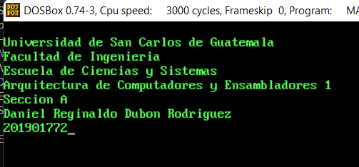 

## Menu Principal

Muestra las diferentes opciones del juego

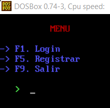 

### **Login:** 
Esta opción permitirá ingresar al menú de juego solicitando las credenciales del usuario, 
Username y password.

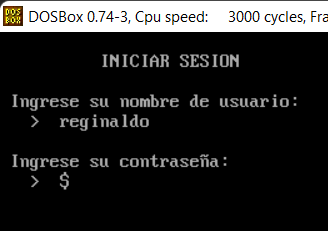 

  El usuario y la contraseña es case sensitive, el ingresar 3 veces erróneas el password se procederá a bloquear el usuario.

  Si el usuario se encuentra bloqueado se mostrara un mensaje de advertencia y se negara el acceso.

  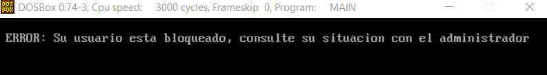 

  En el caso de tratarse del administrador este no se bloqueará totalmente como se establece una política de cooldown de 30 segundos para el siguiente intento esto aplica únicamente luego 
 del tercer erróneo.

 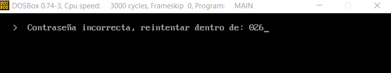 

### **Registrar:** 
Esta opción permitirá al usuario nuevo registrarse en el sistema para poder tener acceso al 
juego.

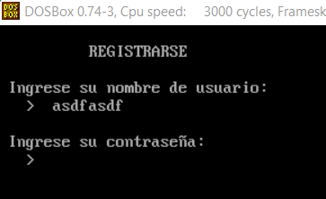 

  Para realizar un registro debe seguir estos pasos y cumplir con las restricciones

  a.  Se solicitará el nombre de usuario y serán las siguientes validaciones:

  -  No puede empezar por número

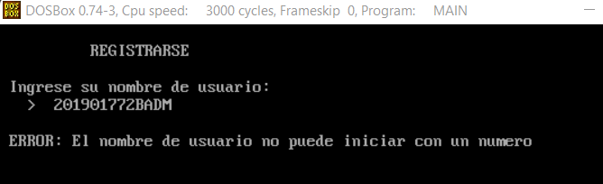 

  - La longitud debe validarse entre 8 y 15 caracteres

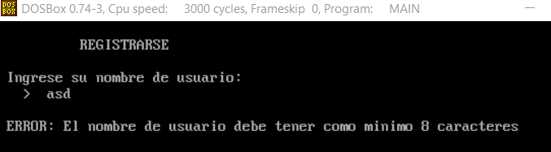 

  - El nombre del usuario no debe existir

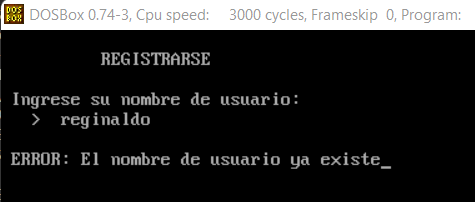 

  - Los únicos caracteres especiales que pueden contener serán:
    - Guión
    - Guion bajo
    - Punto

  b. Se solicitará la contraseña para el usuario y se harán las siguientes validaciones:

  - Debe tener al menos 3 mayúsculas

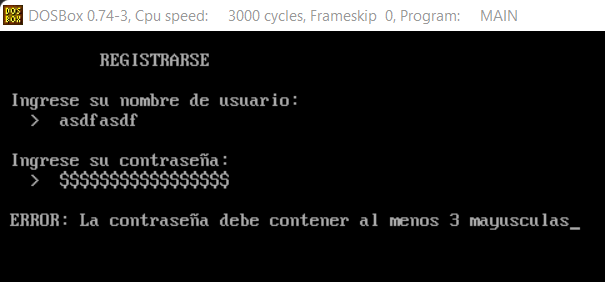 

  - Debe tener al menos 2 numeros
  
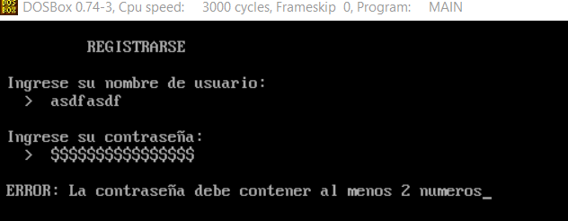 

  - Debe tener al menos 2 caracteres especiales de los siguientes:
    - Arroba (@)
    - Mayor que (>)
    - Numeral (#)
    - Más (+)
    - Asterisco (*)

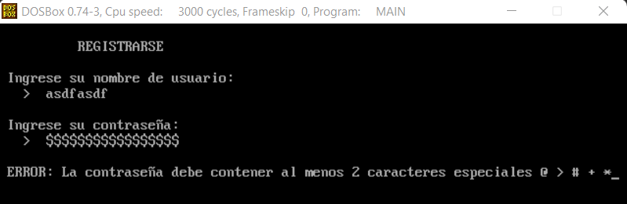 

  - La longitud debe validarse entre 16 y 20 caracteres

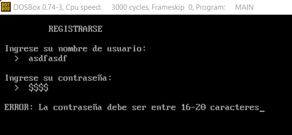 

- **Salir:** Esta opción va a permitir al usuario terminar la ejecución del juego.

## Menu de Usuario:

En este menú se mostraran las diferentes acciones que puede realizar el usuario

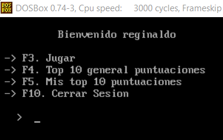 

### Jugar

Al ingresar a la opcion jugar se le mostrara la pantalla de Nivel el cual indica que para iniciar el juego debe presionar le tecla SPACE, cuando usted presione la tecla la pieza comenzara a bajar al igual que el tiempo empezara a correr.

En esta pantalla podra visualizar el usuario activo, su puntuacion, el tiempo que lleva y la pieza siguiente.

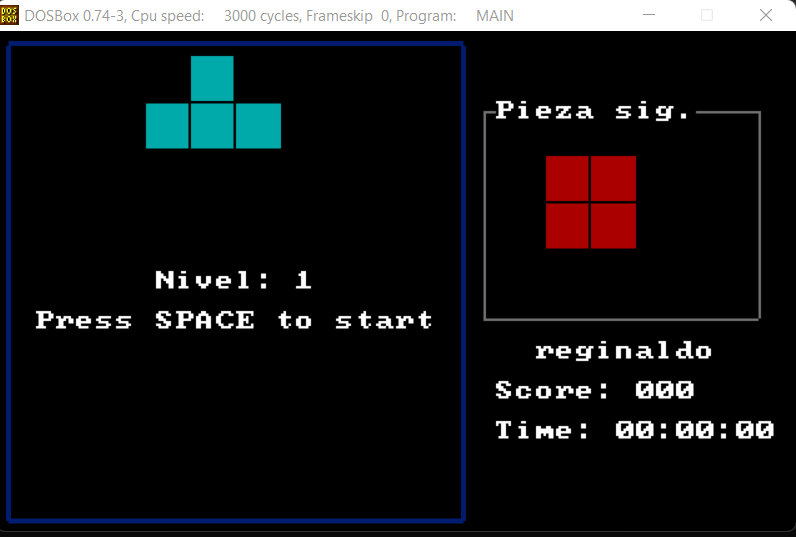 

El juego cuenta con 3 niveles, el para poder superar el primer nivel debera realizar 5 puntos, para superar el nivel 2 debera realizar 40 puntos y para superar el nivel 3 y ganar el juego debera realiar 100 puntos, por cada nivel que sea superado la velocidad con la que bajan las piezas ira aumentando al igual que los puntos que se asignan.

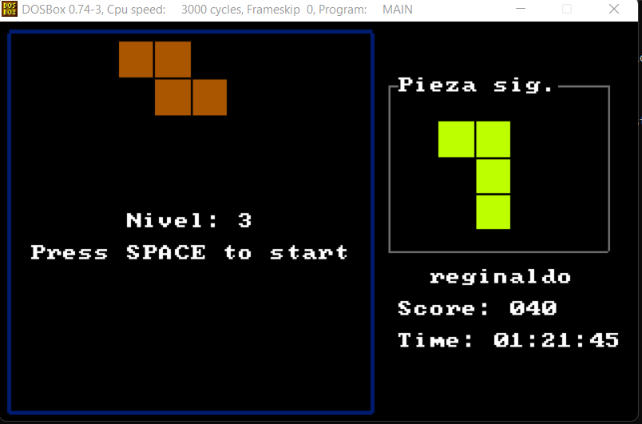 

Para poder poder mover alguna pieza hacia la derecha usted debe de hacer uso de la tecla flecha derecha -> y para moverse hacia la izquierda debera presionar la tecla flecha izquierda <-

Cada una de la piezas podra girar 90 grados con la tecla espacio

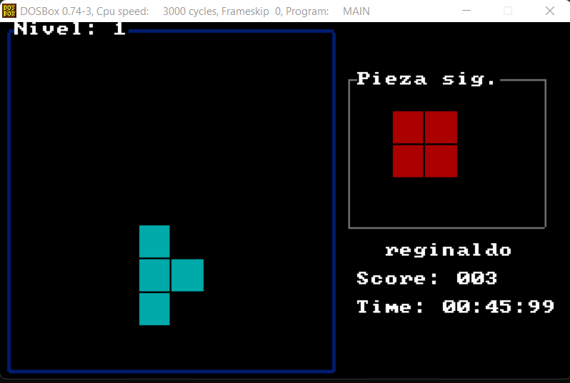 

### Pausa

Para poder entrar a la pausa debera presionar la tecla ESC y se le mostrara un menu donde usted podra terminar el juego o readnuarlo, ademas de brindarle informacion sobre el juego que lleva hasta el momento.

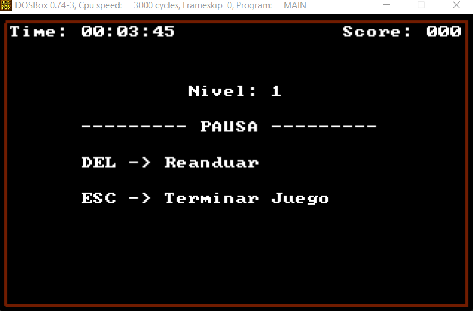 

### Top 10 general

Esta opcion va a mostrar en pantalla las 10 mejores puntuaciones ordenados por los puntos de 
forma descendente. Este top se mostrará hasta que se presione la tecla espacio y se regresará
al menú anterior.

### Top 10 personal

Esta opcion va a mostrar en pantalla las 10 mejores puntuaciones del usuario con que se 
encuentra la sesión iniciada, y deberá mostrar el punteo teniendo en cuenta el ranking general 
de puntuaciones. De igual forma se esperará la tecla espacio para regresar al menú anterior.

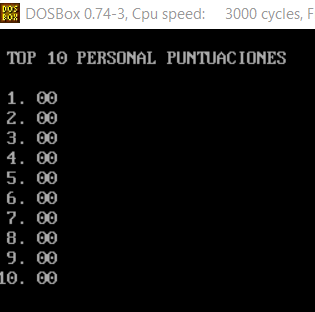 

### Cerrar Sesión

Esta opcion va a cerrar la sesion del usuario actual, mostrando de nuevo el menú principal.

## Menu de Administrador:

En este menú se mostraran las diferentes acciones que puede realizar el Administrador

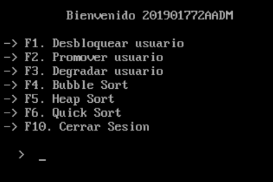 

### Desbloquear usuario

Esta opcion quita el bloqueo que se aplicó a un usuario por terminar los intentos de inicio de 
sesión, en esta se solicitara el nombre del usuario y se notificara la acción que se haga, siendo 
desbloqueado o mostrando que el usuario no se encontraba bloqueado.
Esta opción luego de notificar se debe de esperar que el usuario presione enter para regresar 
al menú anterior.

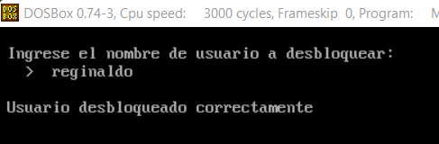 

### Promover usuario

Esta opcion va a otorgarle los permisos de administrador del sistema a un usuario normal, 
exceptuando los de promover y degradar. Esto quiere decir que el único usuario que puede 
promover o degradar usuarios es el administrador general.

Esta opcion solicitara el nombre del usuario y se notificara la acción que se haga, ya sea si se 
pudo promover o no el usuario, al igual que la opcion anterior se esperara un enter para 
regresar al menú anterior

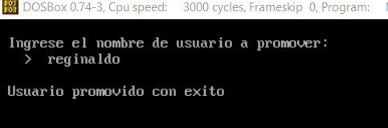 

### Degradar usuario

Esta opcion removerá los permisos de administrador del sistema a un usuario especifico y se 
debe notificar si se logró realizar la operación o no y esperara a que se presione la tecla enter 
para regresar el menú anterior.

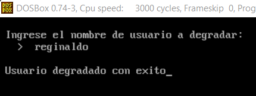 

### Ordenamientos Bubble Sort, Heap Sort y Quick Sort

Al ingresar a alguno de estos ordenamientos se desplegara 3 sub-menus en la cual podra configurar algunos parametros para el ordenamiento

**Seleccionar sentido de ordenamiento**

Permitirá seleccionar si se ordenara de forma ascendente o descendente

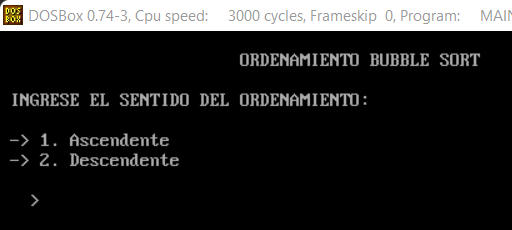 

**Seleccionar tipo de metrica**

Permitirá seleccionar si el ordenamiento se realizara por tiempo o por puntaje obtenido en el juego

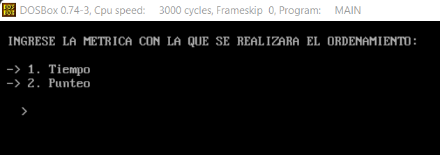 

**Seleccionar velocidad de ordenamiento**

Permitirá seleccionar la velocidad con la cual se visualizara el ordenamiento

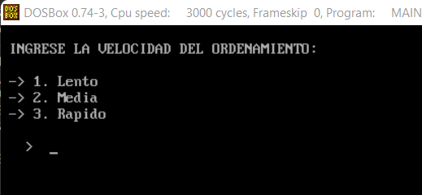 

### Cerrar Sesión

Esta opcion va a cerrar la sesion del usuario actual, mostrando de nuevo el menú principal.

## Menu de Usuario-Administrador:

En este menú se mostraran las diferentes acciones que puede realizar el usuario con privilegios de administrador

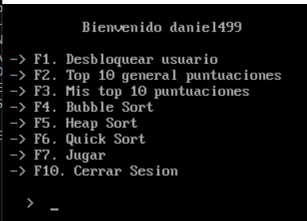 

### Desbloquear usuario

Al igual que el Administador, podra desbloquear usuarios que esten bloqueados

### Top 10 general

Al igual que un usuario normal, podra ver el top 10 usuarios que tienen mayor puntaje en el juego

### Top 10 personal

Al igual que un usuario normal, podra observar sus mejores 10 puntajes obtenidos en el juego

### Jugar

Al igual que el usuario normal podra jugar

### Cerrar Sesión

Esta opcion va a cerrar la sesion del usuario actual, mostrando de nuevo el menú principal.

# Conclusiones

- El modo grafico es una forma de ver la informacion mas agradable y presentable al usuario final.

- Las teclas de funcion programadas son una forma de poder interactuar de mejor forma con los usuarios y hacer el flujo del programa mas agil.